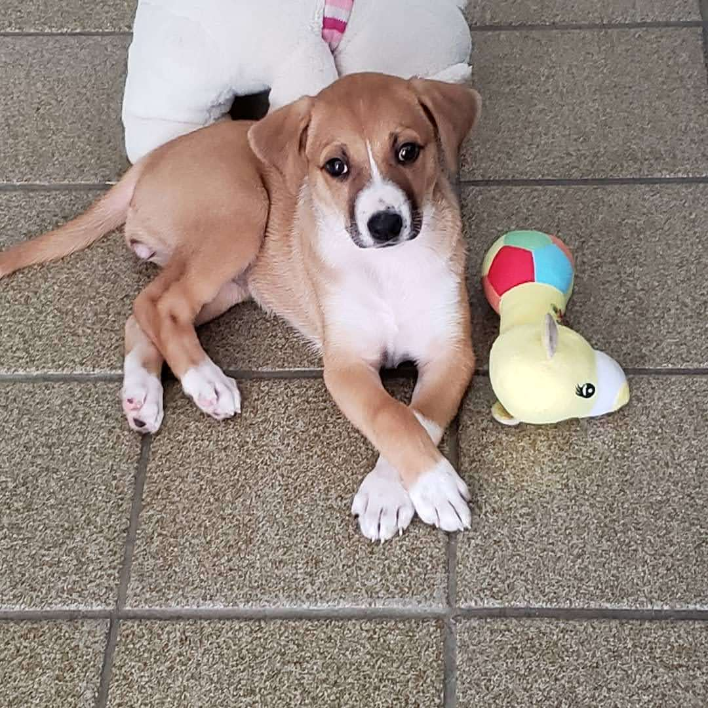

# Dogs Pose Recognition

## About the project

The main goal of this project is to utilize object detection to identify my dogs in three different positions: squatting, sitting, and lying down. As I don't have enough photos of them, I have utilized various data sources to create a comprehensive dataset:

- **Squatting**: I obtained the images from a public Instagram account called ["dogspoopinginprettyplaces"](https://www.instagram.com/dogspoopinginprettyplaces/?hl=en) using the [instaloader](https://instaloader.github.io/) library.
- **Sitting**: I manually selected similar dog images from the [Stanford Dogs dataset](http://vision.stanford.edu/aditya86/ImageNetDogs/) that were in a sitting position.
- **Lying Down**: While most of the images are from my own dogs, I also added a few more from the internet using the ["bing_image_downloader"](https://pypi.org/project/bing-image-downloader/) library.

## Training and Performance

|**Project Type**|**Model**|**Library**|**mAP - 0.5**|**CLS Loss (Validation)**|
|--|--|--|--|--|
|Object Detection|YOLOv5|PyTorch|0.88418|0.00802

### Reports

### Logs

- 🔍[Train Output](assets/train_output.log)